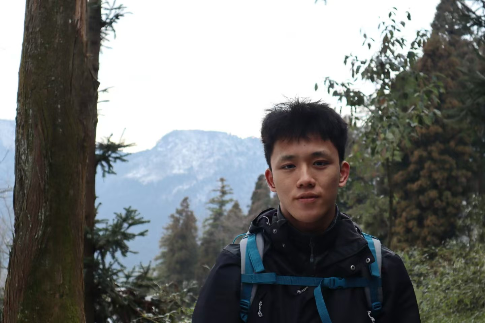

# Xinyuan Cheng 程心远

**Master’s Student in Computational Linguistics**  
LMU Munich, Germany  
[GitHub](https://github.com/noah-13) · [Email](Xinyuan.Cheng@campus.lmu.de) · [Linkeln](www.linkedin.com/in/xinyuan13)

---

## 🧠 Research Interests

- Large Language Models (LLMs)
- Interpretability and Evaluation of NLP Models
- Vision-Language Alignment
- Simplification and Summarization

---

## 🎓 Education

**M.A. Computational Linguistics**, Ludwig-Maximilians-Universität München  
2024 – 2026 (expected)  
Courses: Machine Learning, Data Mining, NLP, Summarization, Information Retrieval

**B.A. German Studies**, Shanghai Jiao Tong University  
2019 – 2023  
Thesis: *Linguistic Ambiguity in German and its Interpretation by LLMs*

---

## 📄 Selected Projects

- **Meta-Evaluation of RAG Metrics**  
  Evaluated robustness of reference-free metrics (e.g., RAGAs, SummaC) across prompt/model variations for retrieval-augmented generation.  
  _Work in progress_

- **SWiPe Dataset Reanalysis**  
  Studied document-level simplification metrics (SARI, LENS-SALSA, QuestEval); compared original and reversed edits.  
  [GitHub Repo](https://github.com/noah-13/re-evaluate-swipe))

---

## 🛠️ Tools & Skills

- Python (NumPy, HuggingFace, fastText, PyTorch)
- Git, Bash, Linux, LaTeX
- English (fluent), German (advanced), Chinese (native)

---

## 📬 Contact

**Email**: Xinyuan.Cheng@campus.lmu.de  
**GitHub**: [noah-13](https://github.com/noah-13)  
**Location**: Munich, Germany
